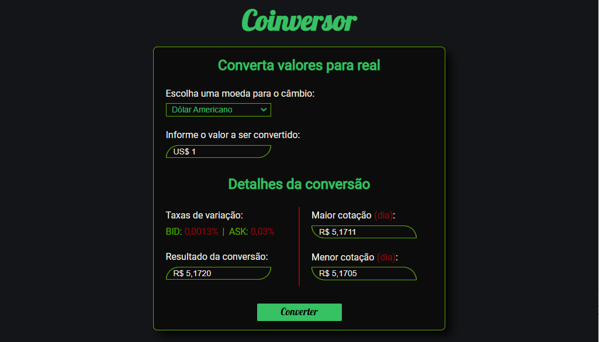

<h1 align="center">Coinversor 💱</h1>

<h4 align="center">
  <a href="#-sobre-o-projeto">Sobre o projeto</a> •
    <a href="#-status">Status</a> •
    <a href="#-features">Features</a> • 
    <a href="#%EF%B8%8F-pré-requisitos">Pré-requisitos</a> • 
    <a href="#-tecnologias-utilizadas">Tecnologias utilizadas</a> • 
    <a href="#-autor">Autor</a> •
    <a href="#-readme-versions">README versions</a>
</h4>

<div align="center">
    
</div>

<div align="center">
    <a href="https://coinversor.netlify.app/">
      
    </a>
    
    
    
</div>

<br/>
<hr>

### 🎯 Sobre o projeto

<p>
  Possuindo mais de 30 opções de moedas, o Coinversor é uma aplicação financeira, desenvolvida com JavaScript puro, para cálculo de conversões monetárias, tal qual, obtenção de informações relacionadas às moedas, como as taxas de variação entre os valores de compra e venda (BID e ASK, respectivamente) e a maior e a menor cotação registrada no dia em questão.
</p>

<hr>

### 🏁 Status

<h3 align="center">
	🎉  Coinversor ✔️ Finalizado 🎉
</h3>

<hr>

### 🏆 Features

- [x] Realizar e exibir o resultado do câmbio monetário;
- [x] Exibir as taxas de variação entre o valor de compra e venda da moeda selecionada;
- [x] Exibir o valor atual da maior e da menor cotação do dia; e
- [x] Formatar os dados monetários de entrada e saída;

<hr>

### ❗️ Pré-requisitos

Fala Dev, beleza? Antes de iniciar seus testes e/ou contribuições na aplicação, é necessário ter o nosso maravilhoso [GIT](https://git-scm.com) instalado, bem como, um bom editor de texto.

Bom, tendo tudo isso pronto e instalado, podemos ir para o passo a passo de como rodar a aplicação.

### 🕹️ Rodando a aplicação

```bash
# Primeiramente, clone este repositório com o GIT
$ git clone <https://github.com/ThiagoBrito-Dev/Podcastr>

# Acesse a pasta do projeto pelo terminal de comando
$ cd .../Coinversor

# E, para finalizar, basta abrir o arquivo "index.html" no seu navegador, ou ainda, utilizando o Live Server, caso você o possua.
```

<hr>

### 🔮 Tecnologias utilizadas

- [HTML](https://devdocs.io/html/)
- [CSS](https://devdocs.io/css/)
- [JavaScript](https://devdocs.io/javascript/)

<hr>

### 👨🏽‍🎓 Autor

<div align="center">
    
    <br />
    <a href="https://twitter.com/JamesRyBrito">
        <h3>
        🤝 Thiago Raniery Brito
        </h3>
    </a>
    <h4>E aí Dev, gostou da aplicação? Bom, se quiser, fique à vontade para entrar em contato comigo por aqui ou pelas tags abaixo.</h4>
    <br />
    <a href="https://www.linkedin.com/in/thiagoranierybrito/">
        
    </a>
    <a href="mailto:thiagobritotrs@gmail.com">
        
    </a>
</div>

<hr>

### 📚 README versions

<p>
    <a href="https://github.com/ThiagoBrito-Dev/Coinversor/blob/main/README.md">Portuguese (pt-br)</a> 
        |   
    <a href="https://github.com/ThiagoBrito-Dev/Coinversor/blob/main/README-en.md">English (en-us)</a>
</p>
