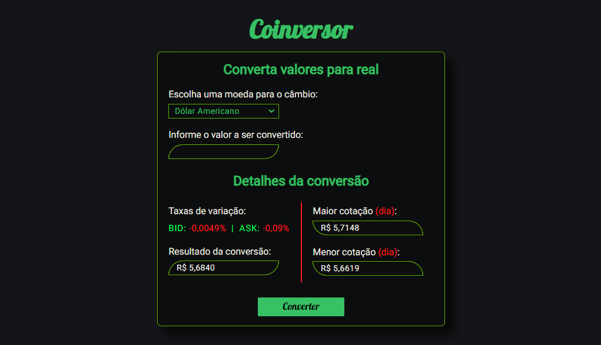

<div align="center">
  <div>
    <h1>Coinversor 💱</h1>
    <p>
      <a href="#-sobre-o-projeto">Sobre o projeto</a> •
      <a href="#-status">Status</a> •
      <a href="#-features">Features</a> •
      <a href="#%EF%B8%8F-pré-requisitos">Pré-requisitos</a> •
      <a href="#-tecnologias-utilizadas">Tecnologias utilizadas</a> •
      <a href="#-autor">Autor</a> •
      <a href="#-readme-versions">README versions</a>
    </p>
    
  </div>

  <div>
    
    <a href="https://coinversor.netlify.app/">
      </a>
    
  </div>
</div>

<hr>

### 🎯 Sobre o projeto

<p>
  Contando com mais de 30 opções de moedas, o Coinversor é uma aplicação financeira, desenvolvida com JavaScript Vanilla, para cálculo de conversões monetárias e obtenção de informações correlatas, como as taxas de variação entre os valores de compra e venda (BID e ASK, respectivamente) da moeda escolhida e a sua maior e menor cotação do dia.
</p>

<hr>

### 🏁 Status

<h3 align="center">
	🎉 Coinversor ✔️ Finalizado 🎉
</h3>

<hr>

### 🏆 Features

- [x] Realizar e exibir o resultado do câmbio monetário;
- [x] Exibir as taxas de variação entre os valores de compra e venda da moeda selecionada;
- [x] Exibir o valor atual da maior e da menor cotação do dia;
- [x] Formatar os dados monetários de entrada e saída; e
- [x] Implementar a responsividade da aplicação;

<hr>

### ❗️ Pré-requisitos

Fala Dev, beleza? Antes de iniciar seus testes e/ou contribuições na aplicação, é necessário ter o nosso maravilhoso [GIT](https://git-scm.com) instalado, bem como, um bom editor de texto.

Bom, tendo tudo isso pronto e instalado, podemos ir para o passo a passo de como rodar a aplicação.

### 🕹️ Rodando a aplicação

```bash
# Primeiramente, clone este repositório com o GIT
$ git clone <https://github.com/trybrito/Coinversor>

# Acesse a pasta do projeto pelo terminal de comando
$ cd .../Coinversor

# E, para finalizar, basta abrir o arquivo "index.html" no seu navegador, ou ainda, utilizando o Live Server, caso você o possua.
```

<hr>

### 🔮 Tecnologias utilizadas

- [HTML](https://devdocs.io/html/)
- [CSS](https://devdocs.io/css/)
- [JavaScript](https://devdocs.io/javascript/)

<hr>

### 👨🏽‍🎓 Autor

<div align="center">
  

  <br />

  <div>
    <h3>
      🤝 Thiago Raniery Brito
    </h3>
    <p>
      E aí, Dev, gostou da aplicação? Bom, se quiser, fique à vontade para contribuir com o projeto e/ou entrar em contato comigo por meio das plataformas abaixo, até mais!
    </p>
  </div>

  <div>
    <a href="https://www.linkedin.com/in/trybrito/">
      </a>
    <a href="mailto:thiagobritotrs@gmail.com">
      </a>
  </div>
</div>

<hr>

### 📚 README versions

<div>
  <a href="https://github.com/trybrito/Coinversor/blob/main/README.md">Portuguese (pt-br)</a>
  |
  <a href="https://github.com/trybrito/Coinversor/blob/main/README-en.md">English (en-us)</a>
</div>
